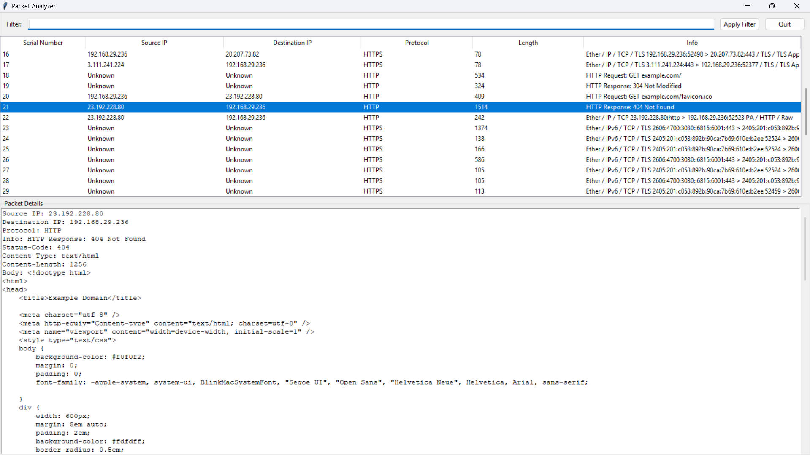
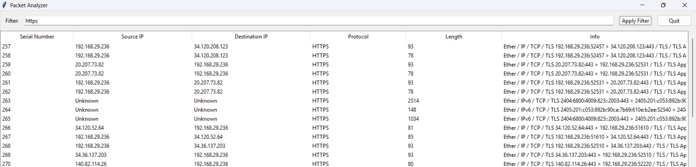

TracePackets is an desktop application that allows you to capture and analyze http/https packets in real time. It is a useful tool for developers to debug and test their web applications. It is also a great tool for security researchers to analyze network traffic and detect potential security threats.

## Features
- Capture http/https packets in real time
- Analyze packet headers and payloads
- Inspect Individual packets for detailed information such as source, destination, protocol, headers, and payloads, etc.


### Preview

- Capture packets in real time & inspect individual packets



- Filter packets to find specific requests or responses



- Save packets data when application is closed


## Dependencies
- Python 3.6 or higher

## Installation
1. Activate your virtual environment
```
python3 -m venv venv
source venv/bin/activate
```
2. Install the required packages using the following command:
```
pip install -r requirements.txt
```

## Usage
1. Run the following command to start the application:
```
python main.py
```

